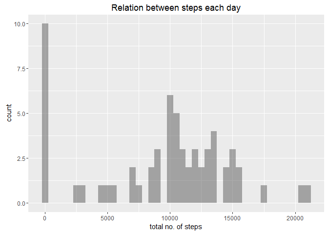
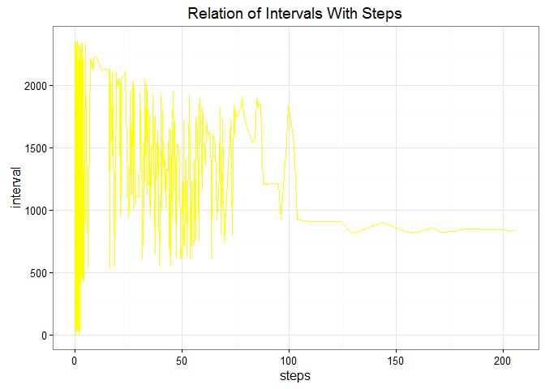
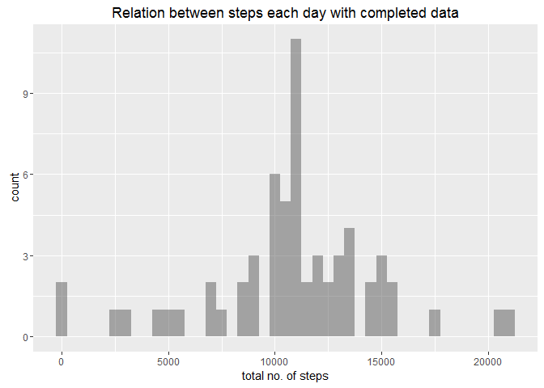
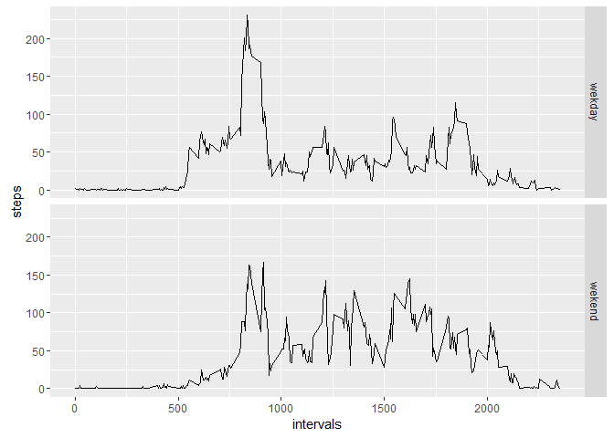

Project week 2 plotting relations
---------------------------------

``` r
library(reshape2)
library(ggplot2)

fname<-"rda.zip"
if(!file.exists(fname)){
  furl<-"https://d396qusza40orc.cloudfront.net/repdata%2Fdata%2Factivity.zip"
  download.file(furl,fname,method ="curl")
  
}
f1name<-"activity.csv"
if(!file.exists(f1name)){
  unzip(fname)
}
```

The first plot relation between days and steps
----------------------------------------------

``` r
ar<-read.csv("activity.csv")
toss<-tapply(ar$steps,ar$date,FUN = sum, na.rm=TRUE)
mean(toss, na.rm = TRUE)
```

    ## [1] 9354.23

``` r
median(toss,na.rm=TRUE)
```

    ## [1] 10395

``` r
qplot(toss,bins=100,binwidth=500,xlab="total no. of steps",geom="histogram",alpha=I(1/2),main = "Relation between steps each day")
```

 \#\# The 2nd plot relation between intervals and steps

``` r
niteeesh<- aggregate(x=list(steps=ar$steps), by=list(interval=ar$interval),
FUN=mean, na.rm=TRUE)
g<-ggplot(niteeesh,aes(x=steps,y=interval))
g+geom_line(colour="yellow")+theme_bw(base_family = "Avenir")+labs(title="Relation of Intervals With Steps")
```

    ## Warning in grid.Call(L_textBounds, as.graphicsAnnot(x$label), x$x, x$y, :
    ## font family not found in Windows font database

    ## Warning in grid.Call(L_textBounds, as.graphicsAnnot(x$label), x$x, x$y, :
    ## font family not found in Windows font database

    ## Warning in grid.Call(L_textBounds, as.graphicsAnnot(x$label), x$x, x$y, :
    ## font family not found in Windows font database

    ## Warning in grid.Call(L_textBounds, as.graphicsAnnot(x$label), x$x, x$y, :
    ## font family not found in Windows font database

    ## Warning in grid.Call(L_textBounds, as.graphicsAnnot(x$label), x$x, x$y, :
    ## font family not found in Windows font database

    ## Warning in grid.Call(L_textBounds, as.graphicsAnnot(x$label), x$x, x$y, :
    ## font family not found in Windows font database

    ## Warning in grid.Call(L_textBounds, as.graphicsAnnot(x$label), x$x, x$y, :
    ## font family not found in Windows font database

    ## Warning in grid.Call(L_textBounds, as.graphicsAnnot(x$label), x$x, x$y, :
    ## font family not found in Windows font database

    ## Warning in grid.Call(L_textBounds, as.graphicsAnnot(x$label), x$x, x$y, :
    ## font family not found in Windows font database

    ## Warning in grid.Call(L_textBounds, as.graphicsAnnot(x$label), x$x, x$y, :
    ## font family not found in Windows font database

    ## Warning in grid.Call.graphics(L_text, as.graphicsAnnot(x$label), x$x, x
    ## $y, : font family not found in Windows font database

    ## Warning in grid.Call(L_textBounds, as.graphicsAnnot(x$label), x$x, x$y, :
    ## font family not found in Windows font database



``` r
niteeesh[which.max(niteeesh$steps),]
```

    ##     interval    steps
    ## 104      835 206.1698

The 3rd plot relation between days and steps with completed data
----------------------------------------------------------------

``` r
chutiya.value <- function(steps, interval) {
    filled <- NA
    if (!is.na(steps))
        filled <- c(steps)
    else
        filled <- (niteeesh[niteeesh$interval==interval, "steps"])
    return(filled)
}
filled.data <- ar
filled.data$steps <- mapply(chutiya.value, filled.data$steps, filled.data$interval)
retoss<-tapply(filled.data$steps,filled.data$date,FUN = sum)
mean(retoss, na.rm = TRUE)
```

    ## [1] 10766.19

``` r
median(retoss,na.rm=TRUE)
```

    ## [1] 10766.19

``` r
qplot(retoss,bins=100,binwidth=500,xlab="total no. of steps",geom="histogram",alpha=I(1/2),main = "Relation between steps each day with completed data")
```

 \#\# The final plot relation between weekdays and steps with mean

``` r
wkday.ya.weekend <- function(date) {
    day <- weekdays(date)
    if (day %in% c("Saturday", "Sunday"))
        return("wekend")
    else if (day %in% c("Monday", "Tuesday", "Wednesday", "Thursday", "Friday"))
        return("wekday")
    else
        stop("invalid date")
}
filled.data$date <- as.Date(filled.data$date)
filled.data$day <- sapply(filled.data$date, FUN=wkday.ya.weekend)
niteeeshchutiya<- aggregate(steps~interval+day,filled.data, FUN=mean, na.rm=TRUE)
ggplot(niteeeshchutiya,aes(interval,steps))+geom_line()+facet_grid(day~.)+xlab("intervals")+ylab("steps")
```


